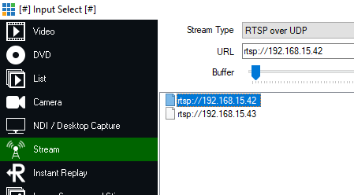
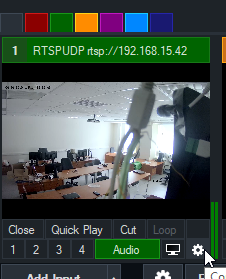
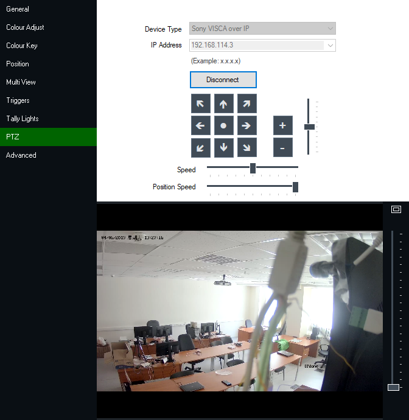

# voproxyd: инструкция по установке и использованию

### Установка

1. Скачайте код

```
$ git clone https://github.com/ruslashev/voproxyd
```

Если Вам не нужна история, то можно передать флаг `--depth=1`.

2. Выполните подготовку перед сборкой

```
$ cd voproxyd
$ make prepare-onvif
```

Успешный вывод выглядит следующим образом:

```
unzip deps/gsoap_2.8.74.zip
configure gsoap
copy gsoap sources
make gsoap
install gsoap
wsdl2h -o deps/onvif/onvif.h
soapcpp2 deps/onvif/onvif.h
soapcpp2 deps/gsoap-2.8/gsoap/import/wsdd5.h
move nsmaps
prepare successul
```

Этот этап может быть относительно долгим, но не больше 5 минут. В случае ошибок выводы команд записываются в `deps/logs/`.

3. Соберите

```
$ make
```

Рекомендуется использовать make с флагом `-j` и количеством потоков в Вашем процессоре, если Вы этого ещё не делаете.

```
download inih
cc avltree.c
cc bridge_inquiries.c
cc buffer.c
cc bridge_commands.c
cc config.c
cc daemonize.c
cc main.c
cc epoll.c
cc socket.c
cc visca.c
cc visca_commands.c
cc visca_inquiries.c
cc worker.c
cc soap_instance.c
cc soap_ptz.c
cc soap_utils.c
cc deps/inih/ini.c
cc deps/onvif/wsseapi.c
cc deps/onvif/soapClient.c
cc deps/onvif/stdsoap2.c
cc deps/onvif/smdevp.c
cc deps/onvif/dom.c
cc deps/onvif/mecevp.c
cc deps/onvif/threads.c
cc deps/onvif/wsddapi.c
cc deps/onvif/duration.c
cc deps/onvif/wsaapi.c
cc deps/onvif/soapC.c
ld voproxyd
successfully compiled voproxyd
```

### Использование

4. При первом запуске программы Вы увидите следующее сообщение:

```
$ ./voproxyd
error: no config file found. searched paths are (in following order):

    $XDG_CONFIG_HOME/voproxyd/config
    $HOME/.voproxyd.conf
    .voproxyd.conf

which on your system are:

    /home/rbakbashev/.config/voproxyd/config
    /home/rbakbashev/.voproxyd.conf
    /home/rbakbashev/Documents/ruslashev/voproxyd/.voproxyd.conf

a skeleton config file was created in $XDG_CONFIG_HOME/voproxyd/config
```

Программа соответствует [XDG Base Directory Specification](https://specifications.freedesktop.org/basedir-spec/basedir-spec-latest.html). Это значит, что Ваша домашняя папка не будет захламлена конфигурационными файлами, однако если Вы хотите хранить настройки там или даже в папке с программой, то так тоже можно.

В сообщении был выведен список в порядке приоритета по которому искались конфигурационные файлы. Они нигде не были найдены, поэтому один был создан за нас в `$XDG_CONFIG_HOME/voproxyd/config`. Заметьте, что, чтобы использовался другой файл, надо просто удалить более приоритетный или переместить его в желаемое место.

5. Отредактируйте файл настроек

Автогенерированный файл содержит в себе следующее:

```
# this is a check to make sure you've modified the example file
unmodified = true # remove this line

username = user
password = pass
ip = 192.168.1.1

# optional parameters and their default values:
# port = 80
# profile_idx = 0
```

Чтобы при повторном запуске программы не использовать данные из примера и Вы не забыли его отредактировать, на первой строке стоит переменная, которую надо удалить (если Вы изменили все данные, но забыли удалить строку, то Вам об этом тоже скажут).

Отредактируйте соответствующие настройки и сохраните файл. Если Вы обеспокоены раскрытием чувствительных данных, поменяйте разрешения файла с помощью `chmod`.

6. Запуск

Программа предоставляет, кроме флага `-h, --help`, флаг `-d, --daemonize`, для того, чтобы запускаться в фоновом режиме. Это удобно для автоматического запуска на старте системы, но не для первоначального пользования, когда надо смотреть в вывод в случае ошибок. В фоновом режиме программа журналирует вывод в `syslog`, который обычно на Linux-системах доступен в `/var/log/syslog`.

Запустите программу:

```
$ ./voproxyd
```

При запуске Вы увидите список доступных профилей. Если Вы хотите использовать какой-либо из них, выберите соответствующий в настройке `profile_idx` в конфигурационном файле.

```
warning: using default port 80. to change add line "port = ..." to config.
device info:
Manufacturer:    HIKVISION
Model:           DS-2DC2204IW-DE3/W
FirmwareVersion: V5.4.0 build 160613
SerialNumber:    DS-2DC2204IW-DE3/W20160726CCCH629386524
HardwareId:      88

available profiles:
 0. name: mainStream, ref. token: Profile_1, video encoder name: VideoEncoder_1
 1. name: subStream, ref. token: Profile_2, video encoder name: VideoEncoder_2
 2. name: thirdStream, ref. token: Profile_3, video encoder name: VideoEncoder_3
 3. name: trackingMain, ref. token: Profile_1052054490, video encoder name: (missing)
 4. name: trackingProfile, ref. token: Profile_558070500, video encoder name: (missing)
 5. name: trackingProfile, ref. token: Profile_683394561, video encoder name: (missing)
```

Также узнайте IP-адрес устройства, на котором запущена программа с помощью `ip addr show`. В этом примере адрес устройства = 192.168.114.3, камеры = 192.168.15.42.

7. Использование в vMix

Запустите vMix.

(опционально) добавьте входной поток через Add Input -> Stream -> RTSP over UDP. URL = `rtsp://` + адрес камеры. Это даст визуальную обратную связь, когда мы будем управлять камерой.



Зайдите в настройки потока -> PTZ. Device Type = Sony VISCA over IP. IP Address = адрес устройства, на котором запущен voproxyd. Порт и ничего больше прописывать не надо, так как он стандартный.



Нажмите OK. Подключение должно пройти мгновенно. Если vMix возвращает ошибку, то удостоверьтесь, что
Ваш компьютер может подсоединиться к устройству с программой, например через `ping`.



Теперь Вы можете управлять общающейся по Onvif камерой из vMix по сопряжению VISCA <-> Onvif благодаря voproxyd.

